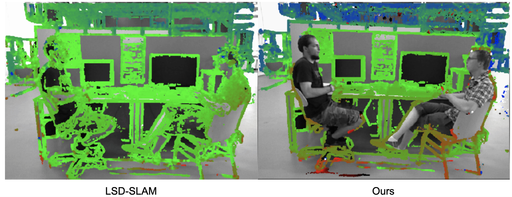
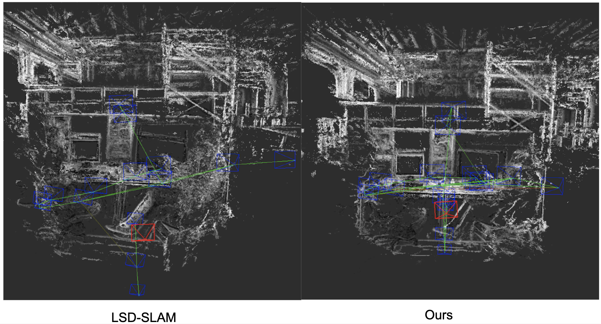
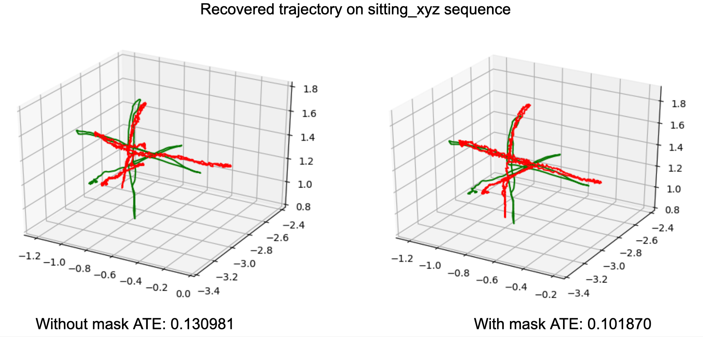

# DDM-SLAM

## Work Overview
1. Motion Segmentation
- Paper "Video Segmentation with Background Motion Models"
2. LSD Front-end revise

## Motion Segmentation
Mask-RCNN Results: https://drive.google.com/drive/folders/1yDduemlchxGtJ1_F2vPLGGYDSs5_cYgH?usp=sharing
Motion Seg Results (700 frames): https://drive.google.com/drive/folders/1w2DSiHP2dQkBwrf1nwqHMli3G6cwbGlb?usp=sharing

## Dataset
TUM Dataset: https://vision.in.tum.de/data/datasets/rgbd-dataset/download#freiburg3_sitting_halfsphere

## LSD-SLAM base code
Please use https://github.com/dknyxh/lsd_slam/ for base code on Ubuntu 16.04

## Slides
https://docs.google.com/presentation/d/1bbOtJrSiUXPgQQNIuZaPbQbvw0hJNiky1KSANuHMgY4/edit?ts=5cc5f536#slide=id.g56d61c4148_0_37

## Sample Results

